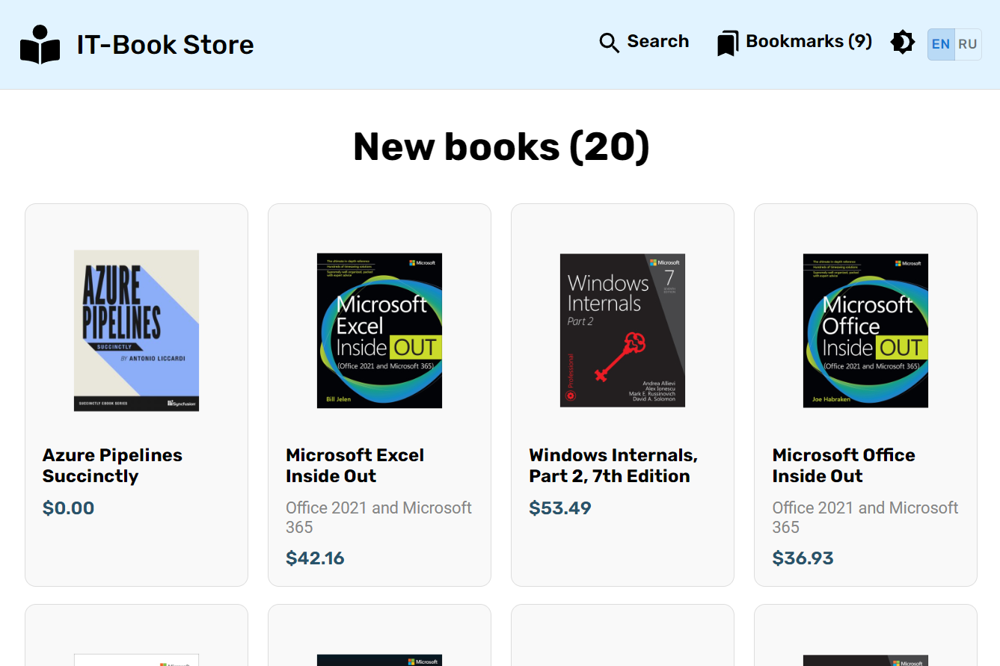
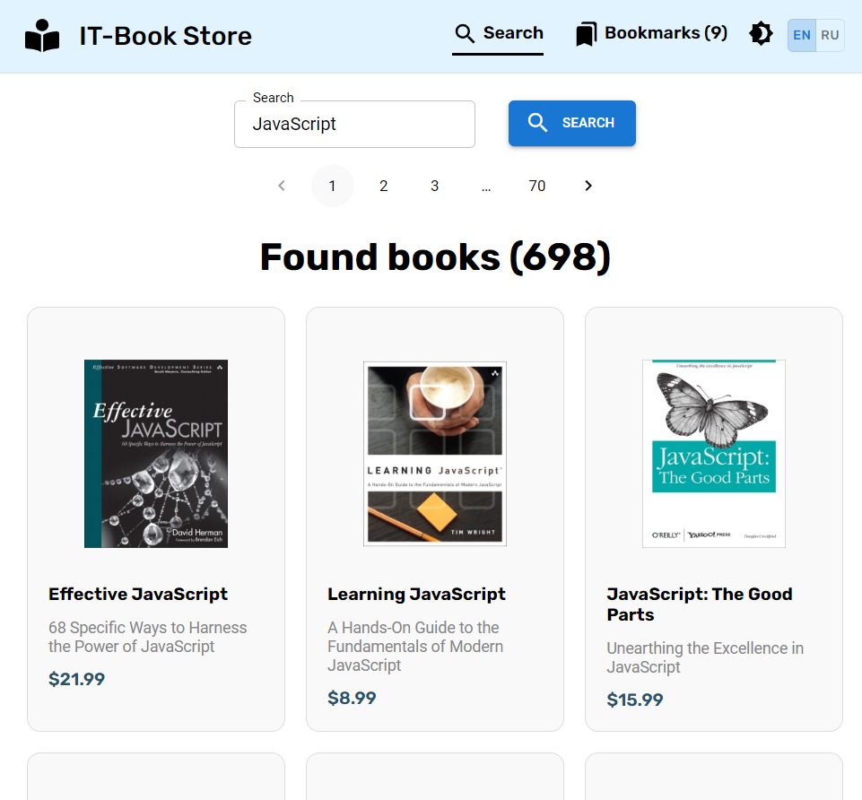

# IT-Book store React app

Used API https://api.itbook.store/

## Example screenshots

### New books

### Search books

### Book details

Book details (mobile dark)

")

### Bookmarks

Bookmarks (dark)

")

Bookmarks (mobile dark)

")

## Available Scripts

In the project directory, you can run:

### `npm start`

Runs the app in the development mode.\
Open [http://localhost:3000](http://localhost:3000) to view it in the browser.
